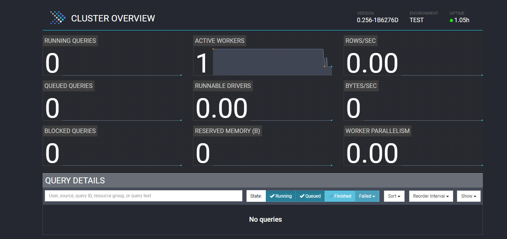

# Apache Presto in Action

In this demo, we will be constructing a single-node Presto server (coordinator), establishing connections to various data sources(Hive and MySQL), and showcasing several steps and queries.

# Table of contents
* [Run Presto Docker Image](#run-presto-docker-image)
* [Run MySQL Docker Image](#run-mysql-docker-image)
* [Hadoop Cluster with Hive Installed](#hadoop-cluster-with-hive-installed)
* [Add Connector to Hive](#add-connector-to-hive)
* [Add Connector to MySQL](#add-connector-to-mysql)
* [Join Between the Two Tables](#join-between-the-two-tables)
* [Push-down Query Optimization in Presto](#push-down-query-optimization-in-presto)
* [Benchmark Results Between Hive, Presto and SparkSQL](#benchmark-results-between-hive-presto-and-sparksql)
* [Query Details in Presto UI](#query-details-in-presto-ui)
* [Presto Useful Commands](#presto-useful-commands)
* [References](#references)

# Run Presto Docker Image

```bash
docker pull ahanaio/prestodb-sandbox
docker network create presto_network
docker run -d -p 8080:8080 -it --net presto_network --name coordinator ahanaio/prestodb-sandboxdb
```

Check cluster UI on the status via *http://localhost:8080/*, by default the `ahanaio/prestodb-sandboxdb` comes with one worker and the coordinator in one single container.



# Run MySQL Docker Image

```bash
docker run --rm -dit -p 3306:3306 -e MYSQL_ROOT_PASSWORD=root --name mysql-container mysql:latest
```

# Hadoop Cluster with Hive Installed

I assume that you have access to a Hadoop cluster with Hive installed. In my scenario, I utilized a Hadoop cluster consisting of five nodes, including the master node, with Hive and Spark installed.

# Add Connector to Hive

Add connection to Hive Meta-store in the Hadoop cluster

1. Run meta-store server in the master node

```bash
master# hive --service metastore
```

2. On the coordinator node (Presto), you can add Hive to Presto's catalogs by including the `hive.properties` file in the directory `/opt/presto-server/etc/catalog`. In my case,`hive.properties` contains connector name and thrift connection to hive meta-store 

```
connector.name=hive-hadoop2
hive.metastore.uri=thrift://172.25.0.100:9083
```

3. Restart the coordinator container to ensure that the configuration takes effect.

```bash
docker restart coordinator
```

4. Now, you have a connection to Hive through Presto

```bash
docker exec -it coordinator bash
bash-4.2# presto-cli --server localhost:8080 --catalog hive

# Create a new database in hive using presto
presto>create schema hive.test;

# Create a new table in hive and fill it using TPC-H benchmarking exercise
presto>create table hive.test.table1 with (format='PARQUET') AS SELECT * FROM tpch.sf1.lineitem limit 100000;

# Count the loaded records
presto>select count(*) from hive.test.table1;
```


# Add Connector to MySQL

1. Create database test

```sql
mysql> Create Database test;
```

2. On the coordinator node (Presto), Add MySQL to Presto's catalogs by including the  `mysql.properties` file in the directory `/opt/presto-server/etc/catalog`. In my case, `mysql.properties` contains connector name and JDBC connection details. 

```
connector.name=mysql
connection-url=jdbc:mysql://host-machine-ip:3306
connection-user=root
connection-password=root
```

3. Restart the coordinator container to ensure that the configuration takes effect.

```bash
docker restart coordinator
```

4. Now, you have a connection to MySQL through Presto

```bash
docker exec -it coordinator bash
bash-4.2# presto-cli --server localhost:8080

# Note
# Take care MySQL connector doesn't support creating schema
presto>create schema mysql.test; # invalid

# Create a new table in mysql and fill it using TPC-H benchmarking exercise
presto>create table mysql.test.table1 AS SELECT * FROM tpch.sf1.lineitem LIMIT 1000000;

# Count the loaded records
presto>select count(*) from mysql.test.table1;
```


# Join Between the Two Tables

```sql
SELECT hive.test.table1.orderkey, hive.test.table1.partkey, hive.test.table1.suppkey 
from hive.test.table1
inner join mysql.test.table1
on hive.test.table1.orderkey=mysql.test.table1.orderkey
limit 10;
```


# Push-down Query Optimization in Presto

execute this query in presto

Note: Hive source contains 6M records and MySQL contains 1M

```sql
presto> explain analyze SELECT hive.test.table1.orderkey, hive.test.table1.partkey, hive.test.table1.suppkey 
from hive.test.table1 
inner join mysql.test.table1
on hive.test.table1.orderkey=mysql.test.table1.orderkey 
where mysql.test.table1.quantity = 22 and hive.test.table1.quantity = 22;
```

result:

```bash
Query Plan                                                                
--------------------------------------------------------------------------------------------------------------------------------------------------------------------------------------------------------------------------------------------------------------------------------
 Fragment 1 [SOURCE]                                                                                                                                                                                                                                                            
     CPU: 26.72ms, Scheduled: 143.98ms, Input: 3943 rows (69.19kB); per task: avg.: 3943.00 std.dev.: 0.00, Output: 1752 rows (46.20kB)                                                                                                                                         
     Output layout: [orderkey, partkey, suppkey]                                                                                                                                                                                                                                
     Output partitioning: SINGLE []                                                                                                                                                                                                                                             
     Stage Execution Strategy: UNGROUPED_EXECUTION                                                                                                                                                                                                                              
     - InnerJoin[("orderkey_0" = "orderkey")][$hashvalue, $hashvalue_29] => [orderkey:bigint, partkey:bigint, suppkey:bigint]                                                                                                                                                   
             CPU: 5.00ms (2.75%), Scheduled: 66.00ms (17.93%), Output: 1752 rows (46.20kB)                                                                                                                                                                                      
             Left (probe) Input avg.: 1975.00 rows, Input std.dev.: 0.00%                                                                                                                                                                                                       
             Right (build) Input avg.: 123.00 rows, Input std.dev.: 7.49%                                                                                                                                                                                                       
                     Collisions avg.: 53.82 (91.13% est.), Collisions std.dev.: 30.60%                                                                                                                                                                                          
             Distribution: REPLICATED                                                                                                                                                                                                                                           
         - ScanFilterProject[table = TableHandle {connectorId='mysql', connectorHandle='mysql:test.table1:test:null:table1', layout='Optional[{domains={quantity=[ [["22.0"]] ]}, additionalPredicate={}}]'}, grouped = false, filterPredicate = (quantity_4) = (DOUBLE'22.0'), 
                 Estimates: {rows: ? (?), cpu: ?, memory: 0.00, network: 0.00}/{rows: ? (?), cpu: ?, memory: 0.00, network: 0.00}/{rows: ? (?), cpu: ?, memory: 0.00, network: 0.00}                                                                                            
                 CPU: 18.00ms (9.89%), Scheduled: 68.00ms (18.48%), Output: 1975 rows (34.72kB)                                                                                                                                                                                 
                 Input avg.: 1975.00 rows, Input std.dev.: 0.00%                                                                                                                                                                                                                
                 $hashvalue := combine_hash(BIGINT'0', COALESCE($operator$hash_code(orderkey_0), BIGINT'0')) (3:12)                                                                                                                                                             
                 LAYOUT: {domains={quantity=[ [["22.0"]] ]}, additionalPredicate={}}                                                                                                                                                                                            
                 orderkey_0 := JdbcColumnHandle{connectorId=mysql, columnName=orderkey, jdbcTypeHandle=JdbcTypeHandle{jdbcType=-5, jdbcTypeName=BIGINT, columnSize=19, decimalDigits=0}, columnType=bigint, nullable=true, comment=Optional.empty} (3:12)                       
                 quantity_4 := JdbcColumnHandle{connectorId=mysql, columnName=quantity, jdbcTypeHandle=JdbcTypeHandle{jdbcType=8, jdbcTypeName=DOUBLE, columnSize=22, decimalDigits=0}, columnType=double, nullable=true, comment=Optional.empty} (3:12)                        
                 Input: 1975 rows (0B), Filtered: 0.00%                                                                                                                                                                                                                         
         - LocalExchange[HASH][$hashvalue_29] (orderkey) => [orderkey:bigint, partkey:bigint, suppkey:bigint, $hashvalue_29:bigint]                                                                                                                                             
                 Estimates: {rows: ? (?), cpu: ?, memory: 0.00, network: ?}                                                                                                                                                                                                     
                 CPU: 1.00ms (0.55%), Scheduled: 4.00ms (1.09%), Output: 1968 rows (69.19kB)                                                                                                                                                                                    
                 Input avg.: 123.00 rows, Input std.dev.: 387.30%                                                                                                                                                                                                               
             - RemoteSource[2] => [orderkey:bigint, partkey:bigint, suppkey:bigint, $hashvalue_30:bigint]                                                                                                                                                                       
                     CPU: 0.00ns (0.00%), Scheduled: 0.00ns (0.00%), Output: 1968 rows (69.19kB)                                                                                                                                                                                
                     Input avg.: 123.00 rows, Input std.dev.: 387.30%                                                                                                                                                                                                           
                                                                                                                                                                                                                                                                                
 Fragment 2 [SOURCE]                                                                                                                                                                                                                                                            
     CPU: 158.56ms, Scheduled: 198.08ms, Input: 100000 rows (815.84kB); per task: avg.: 100000.00 std.dev.: 0.00, Output: 1968 rows (69.19kB)                                                                                                                                   
     Output layout: [orderkey, partkey, suppkey, $hashvalue_31]                                                                                                                                                                                                                 
     Output partitioning: BROADCAST []                                                                                                                                                                                                                                          
     Stage Execution Strategy: UNGROUPED_EXECUTION                                                                                                                                                                                                                              
     - ScanFilterProject[table = TableHandle {connectorId='hive', connectorHandle='HiveTableHandle{schemaName=test, tableName=table1, analyzePartitionValues=Optional.empty}', layout='Optional[test.table1{domains={quantity=[ [["22.0"]] ]}}]'}, grouped = false, filterPredic
             Estimates: {rows: 100000 (3.43MB), cpu: 3600000.00, memory: 0.00, network: 0.00}/{rows: ? (?), cpu: 7200000.00, memory: 0.00, network: 0.00}/{rows: ? (?), cpu: ?, memory: 0.00, network: 0.00}                                                                    
             CPU: 158.00ms (86.81%), Scheduled: 230.00ms (62.50%), Output: 1968 rows (69.19kB)                                                                                                                                                                                  
             Input avg.: 100000.00 rows, Input std.dev.: 0.00%                                                                                                                                                                                                                  
             $hashvalue_31 := combine_hash(BIGINT'0', COALESCE($operator$hash_code(orderkey), BIGINT'0')) (2:6)                                                                                                                                                                 
             LAYOUT: test.table1{domains={quantity=[ [["22.0"]] ]}}                                                                                                                                                                                                             
             orderkey := orderkey:bigint:0:REGULAR (2:6)                                                                                                                                                                                                                        
             quantity := quantity:double:4:REGULAR (2:6)                                                                                                                                                                                                                        
             partkey := partkey:bigint:1:REGULAR (2:6)                                                                                                                                                                                                                          
             suppkey := suppkey:bigint:2:REGULAR (2:6)                                                                                                                                                                                                                          
             Input: 100000 rows (815.84kB), Filtered: 98.03%
```

# Benchmark Results Between Hive, Presto and SparkSQL


# Query Details in Presto UI


# Presto Useful Commands

```bash
presto> show catalogs;  // show the available connections
presto> show schmeas from (choose a catalog, ex: hive)
presto> show tables from your_catalog.your_schema
presto> desc your_catalog.your_schema.your_table
```

# References

[https://dzone.com/articles/hands-on-presto-tutorial-presto-102](https://dzone.com/articles/hands-on-presto-tutorial-presto-102)

[https://ahana.io/blog/presto-104-running-presto-with-hive-metastore/](https://ahana.io/blog/presto-104-running-presto-with-hive-metastore/)

[https://rahulna.medium.com/aws-emr-in-fs-presto-vs-hive-vs-spark-sql-644800c010ad](https://rahulna.medium.com/aws-emr-in-fs-presto-vs-hive-vs-spark-sql-644800c010ad)
